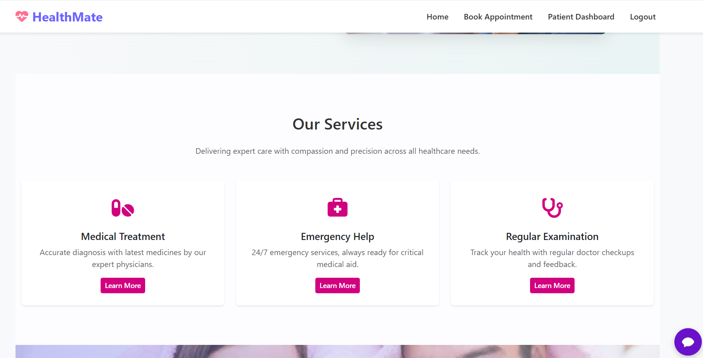
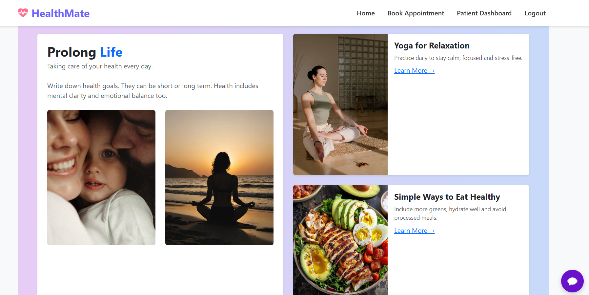
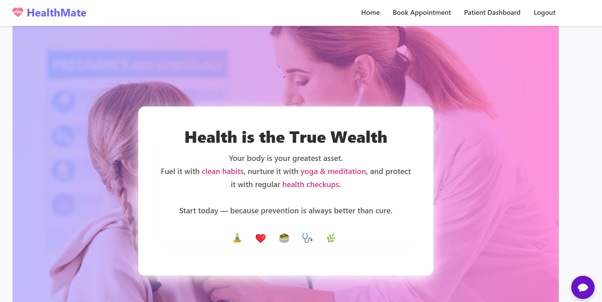
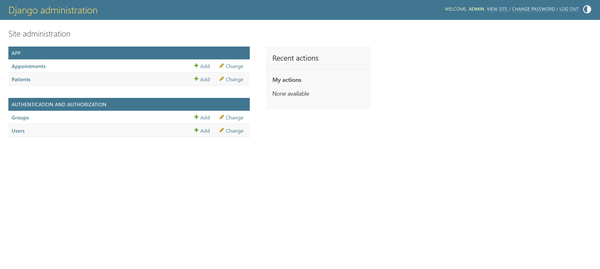

# 🩺 HealthMate — Your Digital Healthcare Companion

HealthMate is a modern web-based healthcare management platform that allows patients to book appointments and doctors to manage them, complete with role-based dashboards, email notifications, and beautiful UI.

---

## 🔥 Features

- 👨‍⚕️ Doctor & Patient role-based login
- 📅 Book and manage appointments
- 📬 Email confirmations for bookings
- 📊 Animated dashboards with charts
- 🔔 Notifications for both users
- 🤖 AI-powered chatbot for assistance
- 🌐 Responsive, attractive UI design

---

## 💻 Technology Stack

- Backend: Django, Python
- Database: MySQL
- Frontend: HTML, CSS, Bootstrap, JavaScript
- Mail: Django Email Backend
- Hosting: GitHub / Render / Railway (TBD)

---
Video presentation link : https://drive.google.com/file/d/1MQIH08FtFYHb0uPxfO7mjJyKYmUjZ4pb/view?usp=sharing
---
Project report : 


---
## 📸 UI Screenshots

### 🏠 Home Page


---

### 🧰 Our Services


---

### 💖 Trust Section


---

### 🧘‍♀️ Health Tips & Blog


---

### 💎 Health is the True Wealth Banner


---

### ⚙️ Django Admin Panel


###👤 Developed by
**MANYA JUNEJA**
📧 manyajuneja03@gmail.com

## 🚀 Getting Started

```bash
git clone https://github.com/manyajuneja1/healthmate.git
cd healthmate
pip install -r requirements.txt
python manage.py migrate
python manage.py runserver


